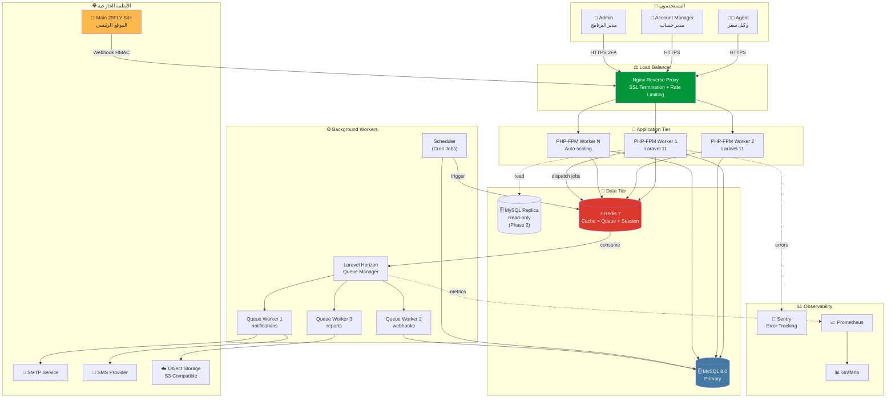
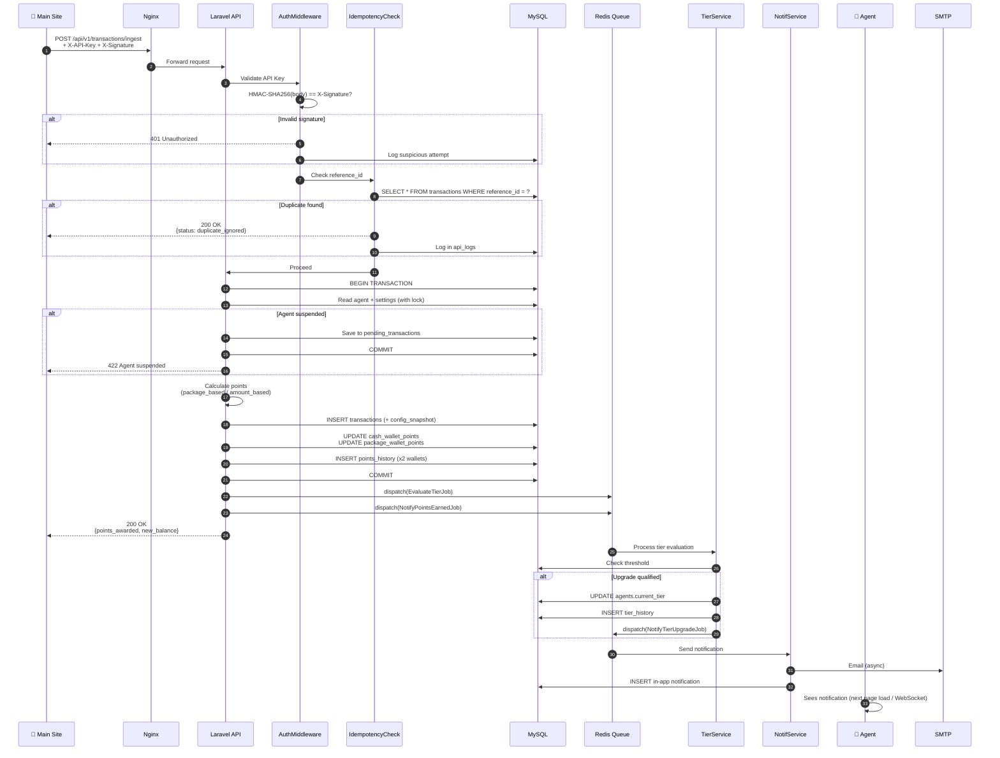
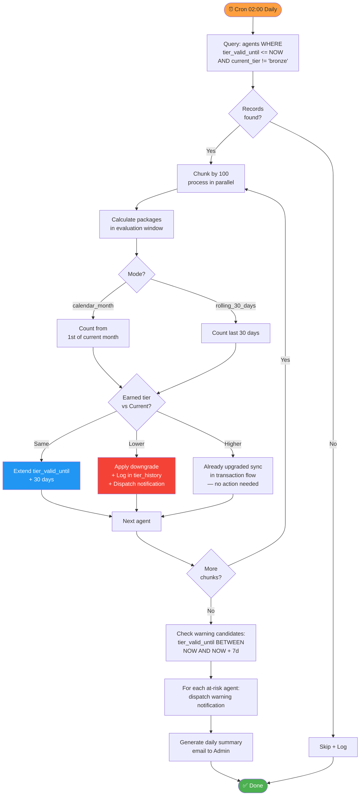
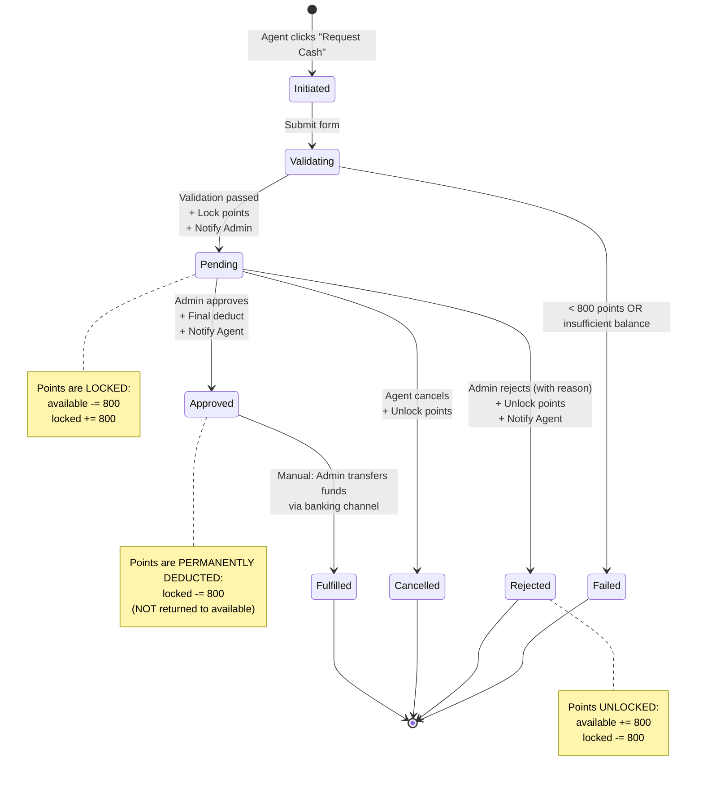
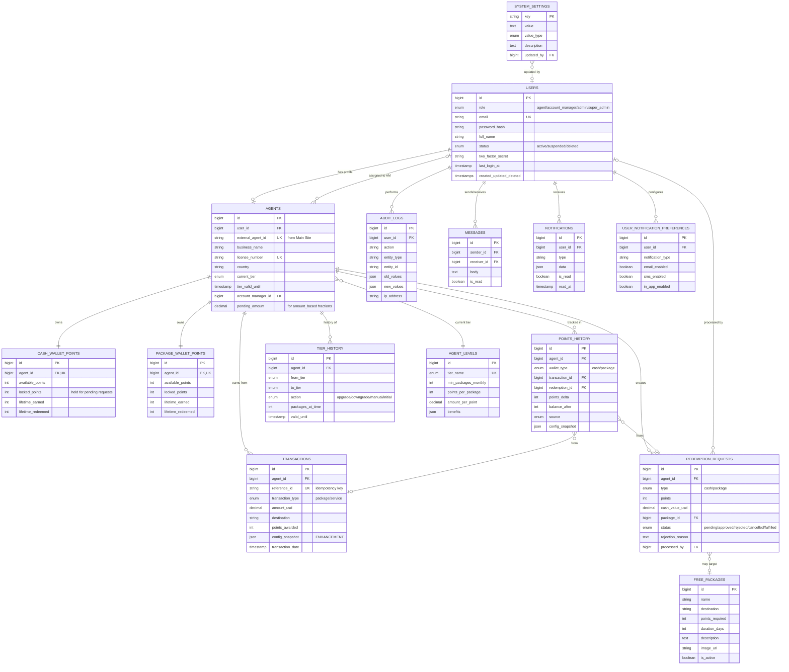
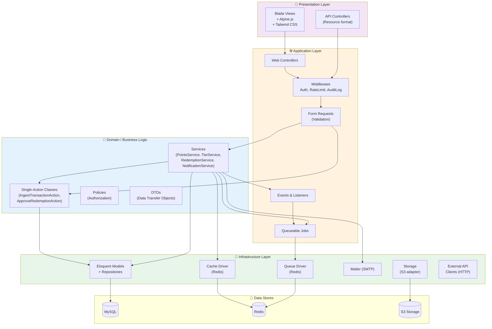
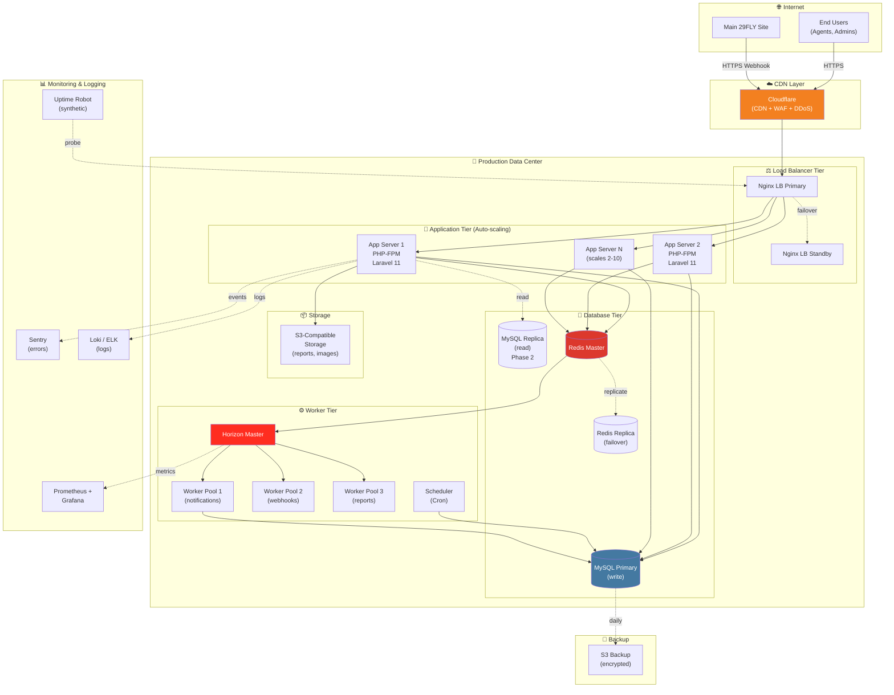
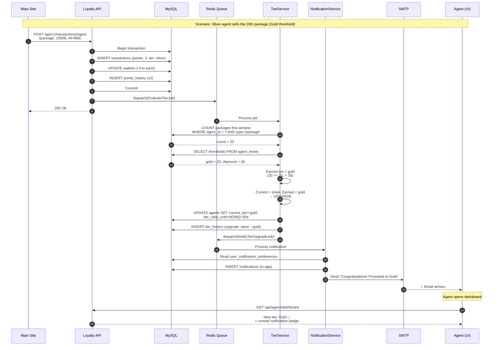
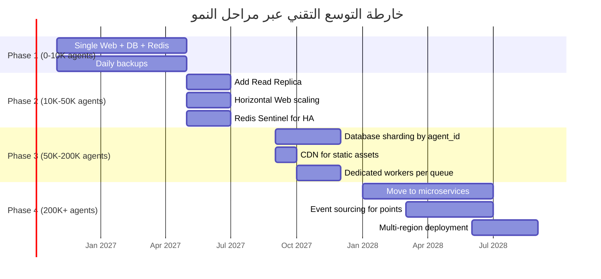

# المخطط المعماري التقني (Technical Architecture)
## برنامج ولاء وكلاء 29FLY

> **الإصدار:** 1.0
> **التاريخ:** نوفمبر 2026
> **التنسيق:** Mermaid Diagrams (تُرسم تلقائيًا على GitHub/GitLab)
> **التصنيف:** سري — للاستخدام الداخلي

---

## 1. نظرة شاملة على البنية (System Overview)

---

## 2. تدفق استقبال المعاملة (Transaction Ingestion Flow)

أهم flow في النظام بأكمله — يجب فهمه بدقة من قبل كل مطور.

---

## 3. تدفق Cron Job — إعادة تقييم التصنيف

---

## 4. تدفق طلب التحويل النقدي

---

## 5. نموذج البيانات (Entity Relationship Diagram)

---

## 6. البنية المعمارية للطبقات (Layered Architecture)

---

## 7. البنية الأمنية (Security Architecture)

```mermaid
flowchart LR
    subgraph External["🌍 Internet"]
        Client["Client / Webhook Source"]
    end
    
    subgraph Edge["🛡️ Edge Layer"]
        WAF["WAF / CDN<br/>(Cloudflare)"]
        DDOS["DDoS Protection"]
    end
    
    subgraph TLS["🔐 TLS Termination"]
        Nginx["Nginx<br/>TLS 1.3 only<br/>HSTS enabled"]
    end
    
    subgraph AppSec["🔒 Application Security"]
        RateLimit["Rate Limiter<br/>100 req/min/IP"]
        APIAuth["API Key Validation"]
        HMAC["HMAC Signature Check<br/>(SHA-256)"]
        Session["Session Auth<br/>(Redis-backed)"]
        TwoFA["2FA for Admins<br/>(TOTP)"]
        CSRF["CSRF Tokens"]
        XSSGuard["Output Escaping<br/>(Blade auto)"]
    end
    
    subgraph DataSec["🗄️ Data Security"]
        Encrypted["Encryption at rest<br/>(MySQL TDE)"]
        Bcrypt["Passwords:<br/>bcrypt cost 12"]
        AuditLog["Audit Log<br/>(immutable)"]
        Backup["Encrypted Backups<br/>(S3 SSE-KMS)"]
    end
    
    Client --> WAF
    WAF --> DDOS
    DDOS --> Nginx
    Nginx --> RateLimit
    RateLimit --> APIAuth
    APIAuth --> HMAC
    HMAC --> Session
    Session --> TwoFA
    TwoFA --> CSRF
    CSRF --> XSSGuard
    XSSGuard --> Encrypted
    Encrypted --> Bcrypt
    Bcrypt --> AuditLog
    AuditLog --> Backup
    
    style WAF fill:#FFB300
    style HMAC fill:#E53935,color:#fff
    style AuditLog fill:#1976D2,color:#fff
    style Bcrypt fill:#388E3C,color:#fff
```

---

## 8. بنية النشر (Deployment Architecture)

---

## 9. ترتيب التدفق الزمني للترقية (Tier Upgrade Sequence)

---

## 10. خطة قابلية التوسع المرحلية

---

## 11. مصفوفة المسؤوليات (Service Responsibilities Matrix)

| Service / Class | المسؤولية الأساسية | Dependencies |
|----------------|--------------------|--------------|
| **AuthService** | تسجيل دخول، 2FA، استرجاع كلمات المرور | User Model, Mailer |
| **IngestTransactionAction** | معالجة Webhook بالكامل | PointsService, TierService, AuditService |
| **PointsService** | حساب النقاط، تحديث المحافظ، history | Settings, Wallet Models |
| **WalletService** | عمليات المحفظتين (lock, deduct, refund) | DB Transactions |
| **TierService** | تقييم وترقية وتخفيض التصنيفات | Agent Model, Settings |
| **RedemptionService** | منطق الاستبدال (cash, package) | WalletService, NotificationService |
| **NotificationService** | dispatch إشعارات متعددة القنوات | Queue, Mailer, SMS Driver |
| **SettingsService** | قراءة وحفظ الإعدادات مع Cache | Redis, AuditService |
| **AuditService** | تسجيل العمليات الحساسة | DB |
| **ReportService** | توليد التقارير وتصديرها | Excel, PDF generators |
| **ReconciliationService** | المطابقة مع Main Site (تحسين مقترح) | HTTP Client, DB |

---

## 12. ملاحظات معمارية ختامية

### مبادئ التصميم المُتبعة
1. **Single Responsibility:** كل Service له مسؤولية واحدة واضحة.
2. **Dependency Injection:** كل Service يُحقن عبر constructor، يسهّل الاختبار.
3. **Repository Pattern (اختياري):** لـ DB queries المعقدة، مع الإبقاء على Eloquent للبسيط.
4. **Event-Driven Updates:** الترقيات والإشعارات تتم عبر Events + Listeners async.
5. **Idempotency First:** كل endpoint قابل للاستدعاء عدة مرات بأمان.
6. **Config Externalization:** صفر `hardcoded` قيم في الكود — كل شيء في `system_settings`.

### الإطار الزمني للبناء
- **MVP (4 أسابيع):** Web + API + Auth + Wallets + Webhook + Basic Admin.
- **Phase 2 (أسبوعان):** Notifications + Redemption flows + Reports.
- **Phase 3 (أسبوعان):** Advanced Admin + Account Managers + Audit + Polish.
- **Phase 4 (أسبوع):** Load testing + Security audit + Production deployment.

### قرارات تقنية رئيسية وتوصيات
| القرار | التوصية | السبب |
|--------|----------|--------|
| Framework | Laravel 11 (ليس CodeIgniter) | Ecosystem، Queue، Eloquent، اختبارات |
| Frontend | Blade + Alpine.js (ليس React/Vue) | SSR، أبسط للنشر، يكفي للمتطلبات |
| Auth | Session-based (ليس JWT للـ Web) | أكثر أمانًا للـ Web، JWT للـ Mobile لاحقًا |
| Queue | Redis + Horizon (ليس DB queue) | الأداء والمرئية |
| Webhook Idempotency | reference_id UNIQUE constraint | بساطة، DB يضمنها |
| Tier Upgrade | Synchronous (مع نفس الـ request) | Agent يرى الترقية فورًا |
| Tier Downgrade | Async via Cron | لا يوجد سبب لفعلها sync |
| Reports > 1000 rows | Async + Email link | تجنب timeouts |

---

**نهاية المخطط المعماري**
